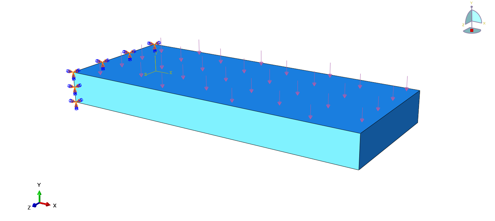
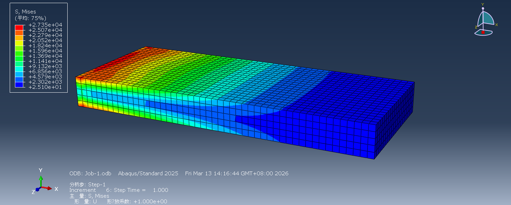
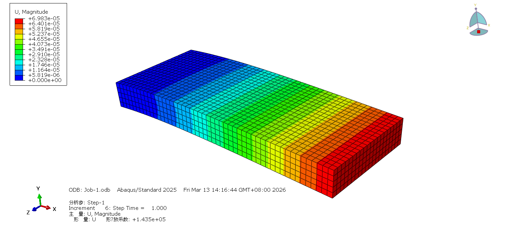
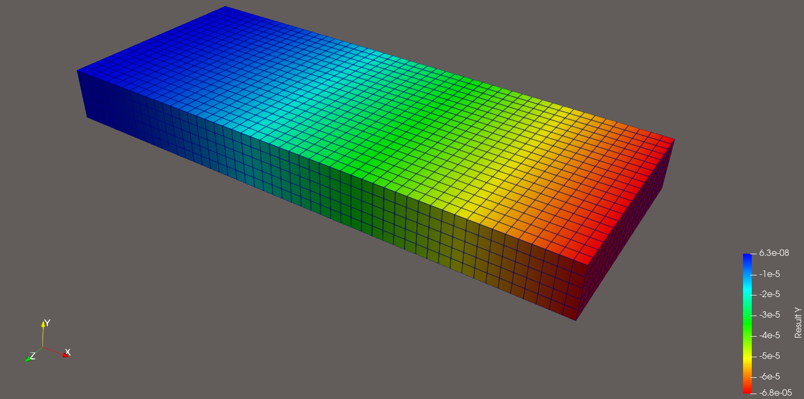
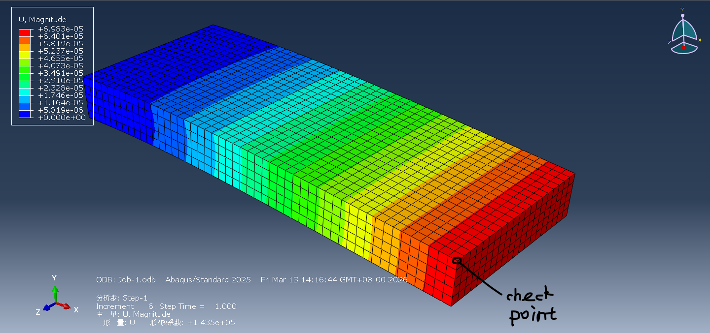
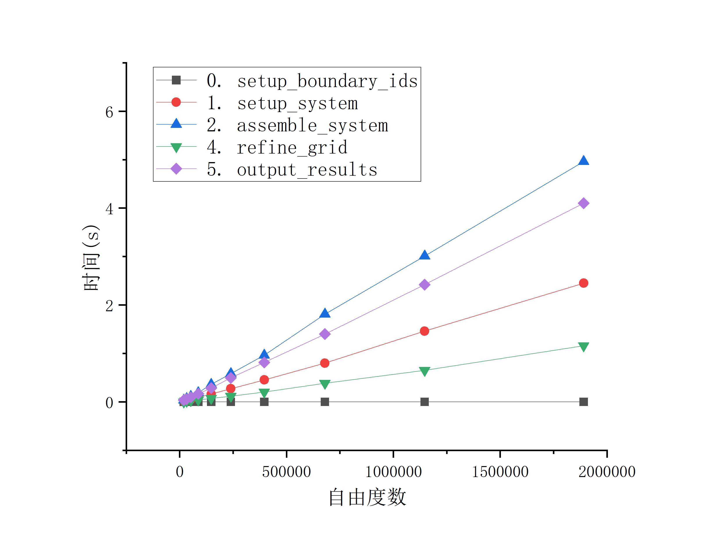
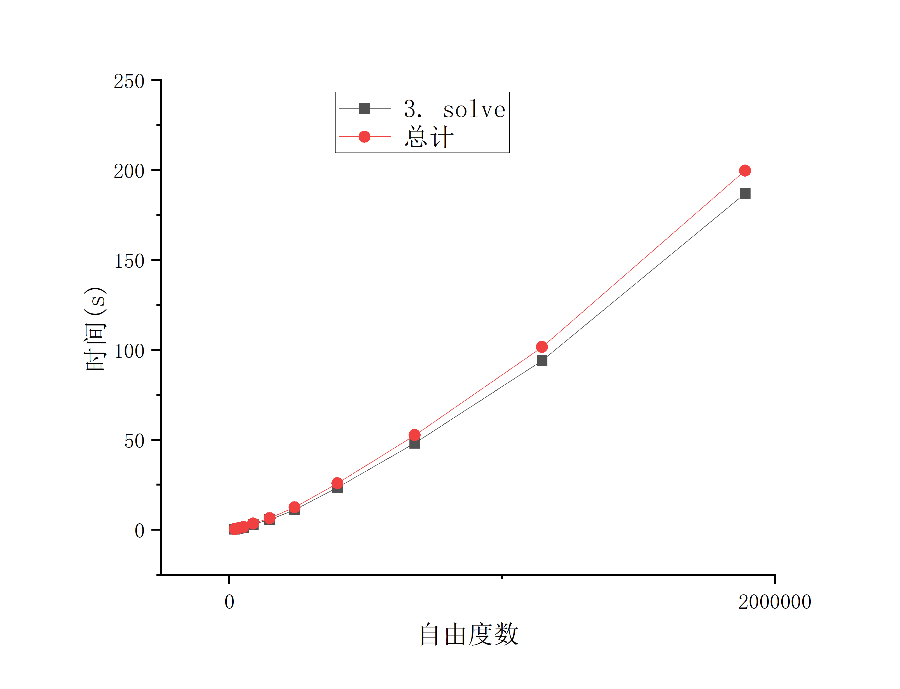

* 边界条件

.png)

网格示意图

几何
x方向：100 m
y方向：10 m
z方向：40 m

表面施加均布荷载：100 N

abaqus单元：C3D8，一阶单元，完全积分，无非协调模式，无减缩积分，无杂交公式

# 🚀 Phase 1: 3D 悬臂梁（纯串行基准版）测试记录

## 第一阶段是纯串行程序，只计算了位移(也就是节点的值)，没有应力等其他物理量。且网格细化是根据位移进行细化，不合理，后续改为根据mises应力细化。

## log.txt和timer_summary.txt分别记录了每一轮循环的时间，已经每轮循环内每一步使用的时间。

#### 1. 物理模型与离散化设置 (Physics & Discretization)

* **材料参数**：线弹性模型，杨氏模量 $E = 210\text{ GPa}$，泊松比 $\nu = 0.3$。
* **边界条件**：左端（ID=1）固定位移（Dirichlet）；受力面（ID=2）施加 Y 方向表面力 $t_y = -100\text{ N/m}^2$（Neumann）。
* **单元类型**：一阶六面体线性位移单元（`FE_Q<3>(1)`）。
* *(注：作为固体力学问题，一阶纯位移单元在承受弯曲荷载时会发生严重的**剪切锁死（Shear Locking）**，导致计算结果偏硬。这将在后续版本中通过提高阶数 `FE_Q<3>(2)` 或使用混合单元来优化。)*

#### 2. 求解器与代数系统设置 (Solver Settings)

* **线性方程组求解器**：共轭梯度法（CG，`SolverCG`）。
* **收敛容差**：`1e-6 * system_rhs.l2_norm()`。
* **最大迭代次数**：1000 次（需确认为何在中途没有触发异常，或后续应改为 `dof_handler.n_dofs()`）。
* **预处理器（Preconditioner）**：对称逐次超松弛迭代（SSOR，`PreconditionSSOR`），松弛因子 $\omega = 1.2$。

#### 3. 性能基准测试结果 (Performance Benchmark)

* **硬件环境**：Intel Core i7-13700F (单线程串行执行，无 MPI/OpenMP/TBB 并行加速)。
* **计算规模演进**：通过 5 次循环，活动单元数从 5000 增至 46万，自由度（DoFs）从 1.9万 增至 148万。
* **核心性能瓶颈分析**：
* **矩阵组装 (`assemble_system`)**：表现出完美的线性扩展性（$O(N)$ 复杂度）。在 148 万自由度下仅耗时约 4.6 秒。
* **求解时间 (`solve`)**：表现出明显的非线性爆炸。在 148 万自由度下耗时高达 153 秒，占总运行时间的 93%。证明 CG+SSOR 组合无法应对百万级规模的三维固体刚度矩阵。

#### 4. 自适应网格加密的局限性发现 (AMR Limitations)

* **当前状态**：使用 `KellyErrorEstimator` 直接对 `solution`（位移向量）进行后验误差估计。
* **问题剖析**：基于位移（或位移梯度）的加密算法，对于固体力学往往是低效甚至错误的。 悬臂梁的位移最大点在自由端，但实际上最危险、应力梯度最高的地方在**固定端（根部）**。单纯基于位移的 Kelly 误差估计，极有可能在自由端进行了过度且无用的网格细化。
* **下一阶段目标**：编写后处理代码，计算各个积分点的 **Von Mises 等效应力**，并将应力场作为 `KellyErrorEstimator` 的输入，引导网格在应力集中区域（固定端根部）进行加密。

---

### 接下来，Phase 2 怎么走？

这份基准记录完美指出了你目前程序的三个升级方向。作为进入下一阶段的开端，你最想先向哪一个方向开刀？

1. **破除性能黑洞**：直接引入 Trilinos 的 **AMG 预处理器**，见证 153 秒的求解时间被瞬间砍到几秒钟的魔法。
2. **走向物理真实**：攻克**基于 Von Mises 应力的自适应网格加密**，让网格真正加密在受力最痛的地方。
3. **解锁硬件极限**：引入 deal.II 的 `WorkStream` 框架，把单线程的 `assemble_system` 改造成 **TBB 共享内存多线程**，榨干你 i7 处理器的全部核心。

# 结果展示

## abaqus结果

## 其余计算结果见./build文件夹下

## vtk文件、log.txt、timer_summary.txt

mises应力

位移

## dealii计算结果

dealii单点位移结果：

位移结果

对比的节点位置在图上标出

abaqus结果：
竖向Y方向位移：-6.96246e-5 m

dealii结果：
竖向Y方向位移：-6.81273e-5 m

误差：2.15%

dealii完全积分的计算结果位移偏小，也就是刚度偏大，这和剪力自锁可能有关系。
目前使用的是一阶单元：
abaqus的计算结果应该更加准确，结果的差异和abaqus内部算法有关系，可能是“Abaqus 在 C3D8 单元的底层偷偷做了一个极其著名的数学手脚，叫做 选择性减缩积分（Selective Reduced Integration）或 B-bar 方法：
    对于剪切和拉伸部分（偏应变）：Abaqus 老老实实用了 8 个积分点。
    对于体积变化部分（体应变）：Abaqus 强行只用了 1 个中心积分点（或者对体积应变进行了全单元的算术平均）！”

改进：
    二阶单元对“剪切锁死”几乎是绝对免疫的，但对“体积锁死”只是大幅缓解，在极端条件下（如不可压缩橡胶）依然会发作。

当将dealii改为FE_Q`<dim>`(2) ^ dim二阶单元。同样该点的y方向位移为-6.97813e-5 m
dealii计算结果比abaqus大一点。因为dealii为二阶，结果应该是dealii的更精确。
与abaqus的一阶单元的结果，该点位移误差为：0.225%。

但二阶单元的自由度明确增大，计算时间达到30s，相比一阶的1s以内，计算量大大增多。

# 串行程序时间复杂度

这些部分都是线性复杂度

CG+SSOR 为 O(1.33)的立方复杂度
