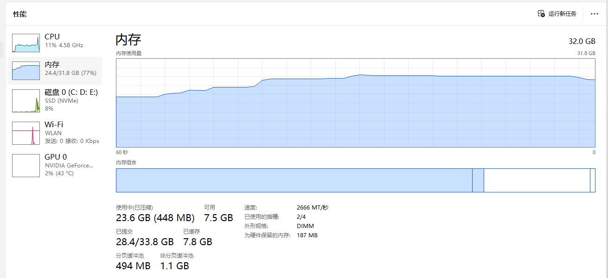
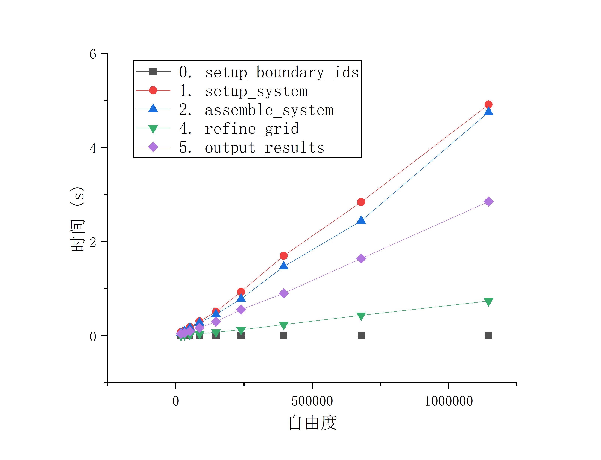
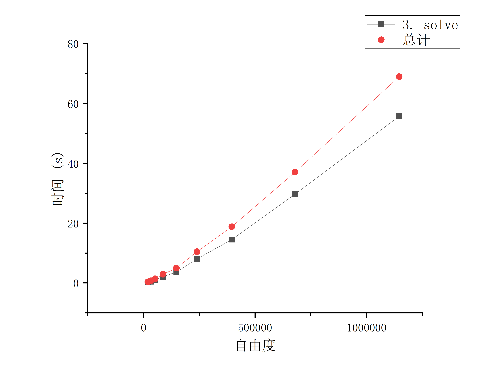
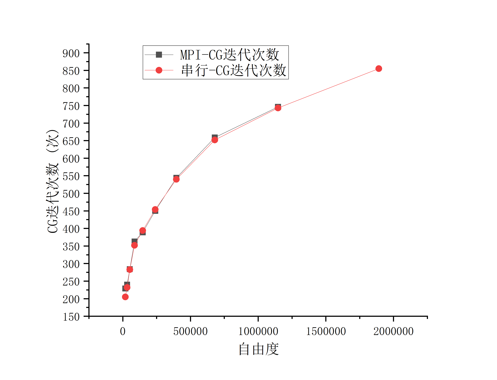
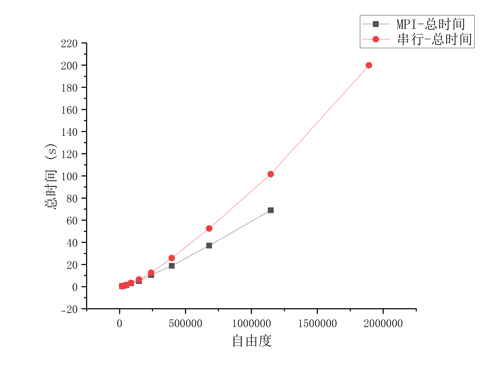

# 总结

该代码为MPI并行代码，但是网格划分等并没有划分到节点，每个节点中存储了所有的网格。
所以当自由度规模较大时，内存占用会很大，甚至会超出单个节点的内存限制。
后续的改进MPI才能实现大规模的并行计算。
这个案例中也出现了大规模网格下内存占用过大，导致程序崩溃的情况。
第一次计算使用8个节点，在第7次计算时内存不足，程序崩溃。
第二次计算使用4个节点，在第9次计算时内存不足，程序崩溃。
展示的结果是第二次使用4个节点计算的结果，

8个节点的内存占用如图所示：

在8个核心下，内存增长非常迅速，第6次迭代成功完成，内存大概使用6G，第7次迭代内存不足报错

# 第一阶段MPI问题

## 内存问题：

1.全图网格 (Triangulation)和[DoFHandler](https://dealii.org/current/doxygen/deal.II/classDoFHandler.html)：每个节点存一份完整的地图。
2.全局稀疏蓝图 (DynamicSparsityPattern)：虽然节点的system_matrix被切分了，但它创建他的稀疏模式是全图的，所以每个节点都存了一份完整的稀疏模式。
3.全图约束矩阵 (Constraints)：每个节点都存了一份完整的约束矩阵。

## 通信问题：

4.解向量的强行全量广播 (MPI_Allgather)：
为了算误差，写了一句 Vector`<double>` localized_solution(solution);将所有节点的解向量都广播到每个节点上。每个节点都存了一份完整的解向量。
5.全图误差名单的拼接 (MPI_Allreduce)：
算完局部误差后，大家又要通过全网归约，拼凑出一个极其庞大的全网单元误差数组。这又是一次昂贵的全局同步（Barrier）。

## 算力浪费：

6.重复细化网格：拿到全网误差名单后，调用 execute_coarsening_and_refinement() 时，所有的 4 个 CPU 核心都在做一模一样的动作——遍历 100 万个单元，切分相同的单元，更新相同的树状数据结构。这意味着，在网格细化（AMR）这个环节，你哪怕用 10000 个 CPU 核心，它的速度不仅不比单核快，反而因为还要等网络通信，比单机单核还要慢！

# 并行结果分析

1.小规模下，串行计算的时间非常短，使用MPI并行反而效率不高。但时间消耗本来就小，差距也不大。
2.中等规模下，串行时间稍微增加，并行计算开始展现出优势。优势随着规模增加而逐渐明显。
3.大规模下，串行时间暴涨，并行计算的优势明显。第8次迭代，自由度规模为114万，串行时间为101s，并行时间为68s，提升32%。使用的是4个核心，计算时间并没有变为原来的1/4。第9次迭代，自由度规模为189万，串行时间暴涨到200s，并行计算4核心下内存不足崩溃了。
4.虽然说Block-Jacobi ILU预处理器在并行下效果下降。但对比串行和并行的迭代次数，差距并不大。第8次迭代，串行迭代次数为743次，并行迭代次数为746次。但无论是串行还是并行，CG的迭代次数都随着自由度规模的增加而增加。
5.Block-Jacobi ILU 的并行惩罚并不明显，可能和问题有关系，现在的几何模型（悬臂梁）相对规则，被切分成 4 块后，大部分“坚硬”的物理连接依然保留在每个进程的本地大块中。被切断的边界连接对整体刚度的影响有限，所以 ILU(0) 退化为 Block-Jacobi 后，精度损失只有区区 3 步迭代。

6.ILU + CG 的时间复杂度是 $O(N^{1.333})$
7.复杂度（时间与规模的关系）与是否并行有关吗？
    在数学阶数（指数）上无关，但在物理常数和通信惩罚上极度相关！
    这意味着求解时间随规模非线性暴涨的“曲线形状”完全没变，硬件并行仅仅是把这条陡峭的曲线整体往下压低了 $P$ 倍而已。

    并行带来的“隐藏惩罚”：数学惩罚（Block-Jacobi 的缺陷）。通信惩罚（Amdahl 诅咒）。等

8.预处理器从 PreconditionILU 换成 代数多重网格（Algebraic Multigrid, AMG）。
AMG 的数学奇迹在于：它能把 CG 的迭代次数强行压制成一个常数（比如永远只需 25 步），即 $N_{iter} = O(1)$。
一旦用了 AMG，你的求解复杂度将瞬间降维：

$$
T_{AMG} = O(1) \times O(N) = O(N)
$$

# 图片结果展示

1. 4核计算下各部分时间随自由度规模关系图：看到复杂度关系是不变的。其余部分依然是线性，求解依然是次方关系，O(N^{1.333})。

2. MPI迭代次数与总时间随自由度规模对比图：

注意到：迭代次数图先陡后缓（先快后慢）
回想一下我们之前推导的 3D 悬臂梁 CG 迭代次数公式。自由度规模设为 $N$。3D 网格细化规律：$N \propto 1/h^3 \implies h \propto N^{-1/3}$。刚度矩阵条件数恶化规律：$\kappa \propto 1/h^2 \implies \kappa \propto N^{2/3}$。CG 算法迭代次数规律：$N_{iter} \propto \sqrt{\kappa} \implies N_{iter} \propto \sqrt{N^{2/3}} = N^{1/3}$。

第二张图（迭代次数 vs 自由度），在数学本质上就是画了一条幂函数曲线：

$$
y = c \cdot x^{1/3}
$$

---

# 深度总结：基于 MPI 的有限元并行计算（阶段一架构）

## 一、 核心架构剖析：内存的“指数诅咒”

本程序采用的是 **“网格全局复制 + 代数方程分布式求解”** 的初级 MPI 并行架构。

* **内存暴涨的根源（$O(N \times P)$ 陷阱）**：在当前的架构下，虽然 Trilinos 矩阵和向量被切分成了独立的块，但最占用内存的拓扑结构（`Triangulation` 和 `DoFHandler`）以及预分配辅助矩阵（`DynamicSparsityPattern`）却在每个 MPI 进程中都完整保留了一份。
* [cite_start]**物理崩溃点**：如测试所示，在 8 核心下运行，内存增长极为恐怖。当循环进行到中后期（例如自由度从第 0 轮的 19278 [cite: 116] 暴涨到几百万），单个核心的内存消耗不仅没有减少，反而因为多进程全量复制，导致系统总内存消耗呈几何级数放大（总消耗 $\approx$ 单机内存需求 $\times$ 核心数 8），最终触发 Linux 操作系统的 OOM（Out-Of-Memory）Killer 导致程序强行终止。

## 二、 性能表现与时间开销分析

根据日志输出的性能剖析，并行与串行计算在不同规模下表现出截然不同的特性：

1. [cite_start]**小规模的“并行惩罚”**：在最初的几轮循环中（如 Cycle 0，总耗时仅约 0.321s [cite: 94, 117]），串行时间极短。此时引入 MPI 并行，由于跨节点通信、预处理器的初始化以及网格同步的开销远大于计算收益，并行效率反而不高。
2. [cite_start]**大规模的算力转移**：随着自由度规模扩大，系统瓶颈发生转移。在 Cycle 9（自由度 1890834 [cite: 197][cite_start]）中，串行总时间飙升至 200s [cite: 198]。其中：
   * [cite_start]**矩阵组装（Assemble）极其适配并行**：组装阶段各进程完全独立计算本地单元，无通信开销（“包产到户”），在串行下仅占 2.5%（4.96s）[cite: 203]，在多核并行下这部分时间能实现近乎完美的线性缩减。
   * [cite_start]**求解（Solve）成为绝对瓶颈**：在 Cycle 9 中，求解时间高达 187s，占比 94% [cite: 204]。解线性方程组成为了制约整个程序效率的最核心痛点。

## 三、 算法层面的“工程妥协”

并行计算下，程序不仅在时间上发生了变化，其背后的数学逻辑也做了深度妥协：

1. **CG 迭代次数增加的数学本质**：并行计算下的 CG 迭代次数多于单机串行。这是因为我们使用了 `TrilinosWrappers::PreconditionILU`。在 MPI 分布式环境下，它在底层自动退化为了 **Block-Jacobi ILU**（块雅可比预处理）。算法直接“砍掉”了跨进程的非对角线矩阵块，每个进程仅在本地做 ILU(0)。切分的核数越多，丢失的全局耦合信息越多，预处理效果越差，导致求解器需要更多的迭代步数来收敛。
2. **悬挂节点与网格细化的“全量收集”瓶颈**：为了处理网格局部细化产生的悬挂节点约束，程序被迫在求解完毕后调用 `Vector<double> localized_solution(solution);` 进行 `MPI_Allgather` 操作，让所有进程都拷贝一份完整的全局位移场。这是目前架构中最大的可扩展性（Scalability）毒瘤。

## 四、 后续演进路线（Roadmap）

要真正实现大规模（上千万至亿级自由度）的超算并行计算，彻底告别单节点内存限制，必须向**“阶段二：完全分布式网格”**演进：

* **引入 p4est 森林算法**：将原生 `Triangulation` 替换为 `parallel::distributed::Triangulation`。
* **内存极限压缩**：实现真正的 $O(N/P)$ 内存缩放。每个节点仅存储属于自己的网格单元和极其薄的一层“幽灵单元（Ghost Cells）”。从而彻底消除内存瓶颈，真正释放集群的无尽算力。
