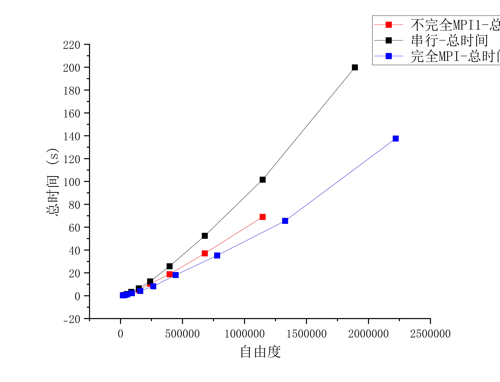
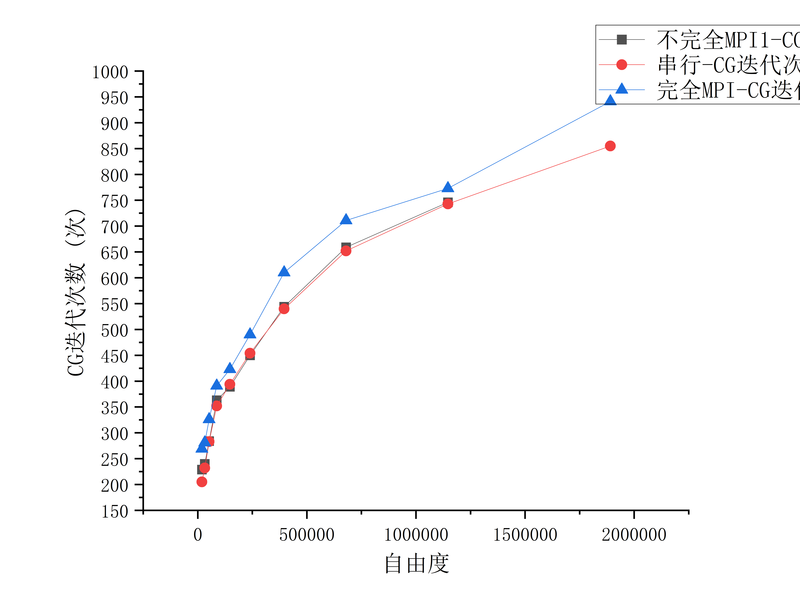
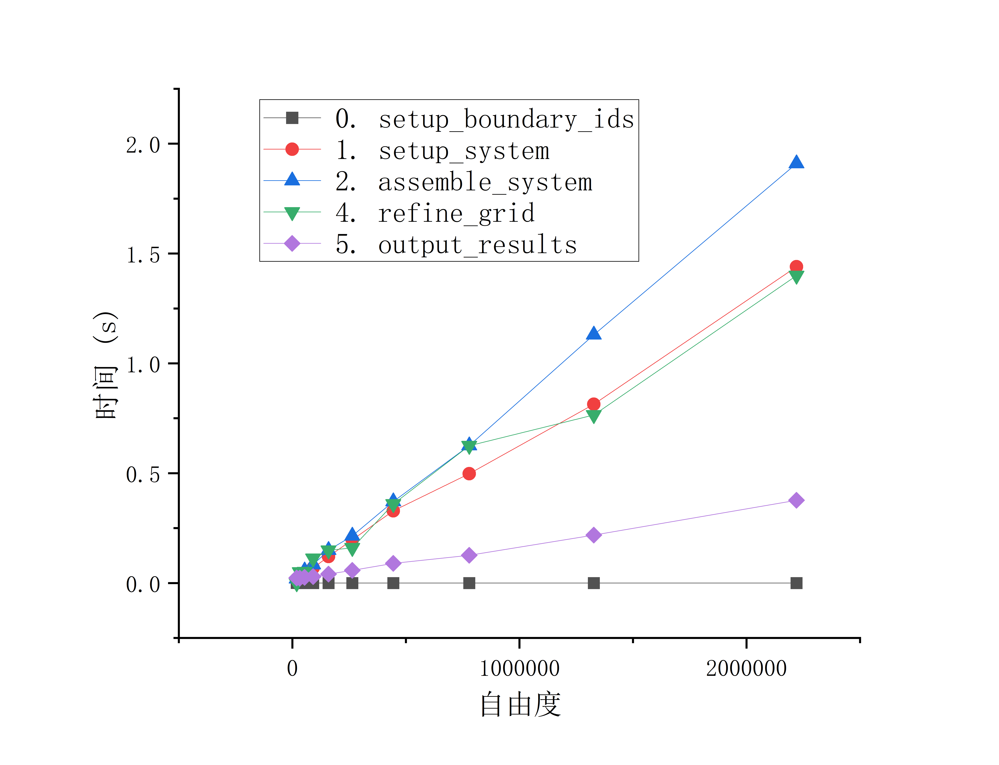
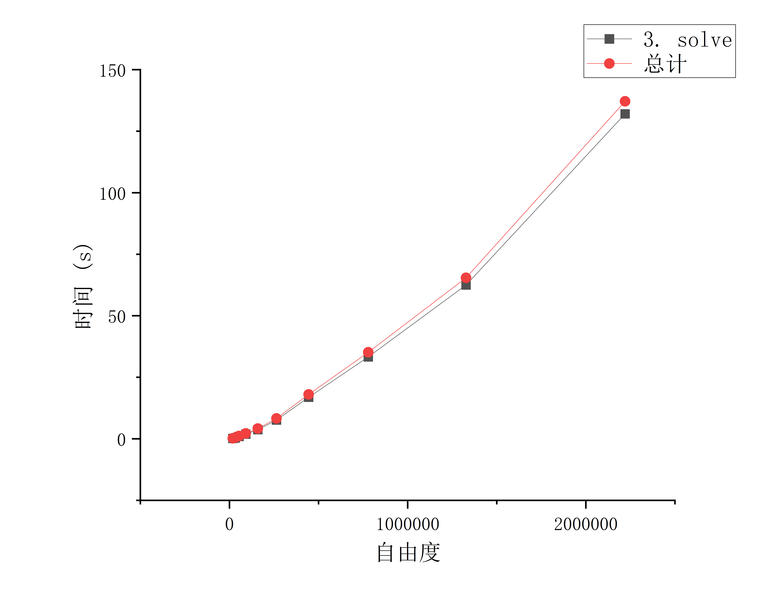

# 总结

该代码为完全版MPI代码，将网格和dsp等分布到计算节点。每个节点只存储部分数据。

使用8个节点进行计算，电脑32G内存，完成10次计算，没有内存报错。

ILU的迭代次数随自由度规模的增加而增加。复杂度的关系依然没有变。
但完全版MPI的计算时间比串行和不完全版的都要短，说明分布式计算的优势明显。

总的来说，setup_system, assemble_system等部分计算用时很少，主要的计算时间集中在求解器solve上，尤其是迭代求解器的迭代次数较多时，求解时间会显著增加。随着自由度规模增长，求解器用时占比达到95%以上。

### 串行-不完全MPI-完全MPI计算总时间对比:

### 串行-不完全MPI-完全MPI迭代次数对比:

### 完全MPI下不同部分的计算时间和求解时间:

很奇怪的是网格细化，在后续自由度下，计算时间有一个整体的下降

#### 关于为什么完全 MPI 下，refine_grid 的时间在后期反而下降了：

1. “表面积/体积比” 的红利 (Surface-to-Volume Ratio)在早期的几次循环（比如几万自由度），每个 MPI 进程分到的本地单元（Owned）很少，但它需要维护的幽灵单元（Ghost）比例极高。小规模时：你在算 Kelly 误差时，绝大部分时间都花在了通过 MPI 向邻居要数据（处理边界）上。网络延迟（Latency）主导了计算时间。大规模时：当网格来到上百万时，每个进程本地的单元数呈现三次方增长 $O(N)$，而交界面的幽灵单元只呈现二次方增长 $O(N^{2/3})$。这意味着在后期，CPU 绝大多数时间都在毫无阻碍地纯算本地内存里的数据，完美掩盖了网络通信的时间。
2. p4est 八叉树的“热身完毕”p4est 库的设计初衷就是为了处理百亿级别的网格。在早期网格很粗时，网格的拓扑结构还在剧烈变动，建立分布式八叉树（Octree）的固定成本（Overhead）显得相对较高。到了后期，底层的八叉树森林骨架已经极其稳固，细化网格只是在局部的“树叶”上进行分裂，这种纯内存操作对现代 CPU 来说快如闪电。
3. 动态负载均衡（Load Balancing）的“局部化”在早期（Cycle 1-3），网格可能从极其均匀突然变得极其不均匀。这会导致 p4est 触发大规模的“跨国大迁徙”，成千上万的单元通过 MPI 从 Rank 0 搬家到 Rank 7，极其耗时。到了后期（Cycle 7-9），应力集中的区域已经完全确定（比如固定端或受力点）。此时的网格加密高度集中在极小的一片区域里，每次加密后，p4est 只需要在相邻的几个 Rank 之间做极其微小的“边界微调”即可完成负载均衡，数据迁移量断崖式下跌。

### 完全MPI下不同部分的计算时间和求解时间:

